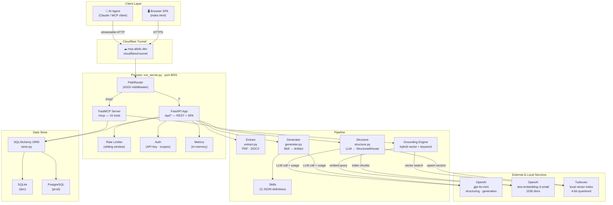
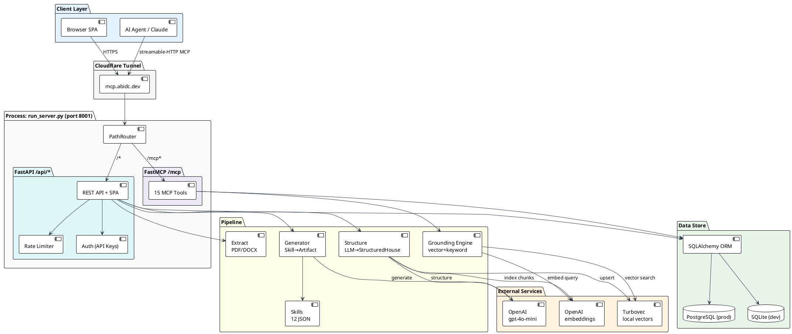

# MsgStack MCP — System Architecture

## Overview

MsgStack MCP is a dual-protocol server: it exposes an **MCP (Model Context Protocol) interface** for AI agents and a **FastAPI web application** for human operators. Both share the same process, database, and pipeline code. The core purpose is to transform raw source documents into structured "Canon Domains" (which implement B2B Message Houses and other departmental knowledge sets) and generate on-brand content artifacts grounded in that approved canon.

---

## Component Map

```
┌─────────────────────────────────────────────────────────────────────────┐
│                        PROCESS: run_server.py                           │
│                                                                         │
│   PathRouter (ASGI)                                                     │
│   ├── /mcp*  ──────────────────────► FastMCP Server (server.py)        │
│   │                                   15 tools over streamable-HTTP     │
│   │                                   (Grounded in Canon Domains)       │
│   └── /*     ──────────────────────► FastAPI App (web_app.py)          │
│                                        REST API + Jinja2 frontend       │
└─────────────────────────────────────────────────────────────────────────┘
```

---

## Layer-by-Layer Architecture

### 1. Entry Point — `run_server.py`

`PathRouter` is a minimal ASGI middleware that routes by path prefix without stripping the prefix (FastMCP requires full paths). It delegates the `lifespan` event to the FastMCP app so its session task group initialises correctly.

```
Request → PathRouter
           ├── path starts with /mcp → FastMCP ASGI app
           └── everything else       → FastAPI ASGI app
```

Both apps share the same OS process and Python interpreter, so they share the module-level `Store` singleton and `SkillManager` instance.

---

### 2. MCP Server — `src/server.py`

Built on **FastMCP 3.x** using the `streamable-http` transport. Exposes 15 tools to any MCP-capable AI client (Claude Desktop, Claude Code, custom agents).

**Tools by category:**

| Category | Tools |
|---|---|
| Domain resolution | `list_message_houses` (lists domains), `set_active_house` (activates domain), `get_message_house` (gets domain), `get_grounding_context` |
| Search | `search_messaging` |
| Comparison | `compare_houses` |
| Generation | `generate_one_pager`, `generate_social_posts`, `generate_email_template`, `generate_artifact`, `build_ui_artifact` |
| Skills | `list_skills` |
| Inspection | `check_framework_completeness`, `get_framework_spec` |
| Admin | `seed_database`, `reset_conversation` |

**Domain resolution workflow** (enforced in tool descriptions):
```
list_message_houses → set_active_house → [any other tool]
```
Tools that need a domain accept `house_id` (UUID) or `house_name` (string) and call `_resolve_house()` to canonicalise.

---

### 3. FastAPI Web App — `src/web_app.py`

REST API + Jinja2 dashboard. All routes are under `/api/*` except the dashboard root (`/`), artifact renderer (`/artifact/*`), and health check (`/health`).

**Middleware stack (inbound order):**
1. `CORSMiddleware` — configurable origins via `CORS_ORIGINS` env var
2. `log_requests` — structured logging + in-memory metrics accumulator

**Auth model:**
- `MSGSTACK_AUTH_ENABLED=false` (default): all requests return `_OPEN_AUTH` sentinel with all scopes; zero overhead
- `MSGSTACK_AUTH_ENABLED=true`: `X-API-Key: msk_<token>` or `Authorization: Bearer msk_<token>` required; SHA-256 hash checked against DB

**Rate limiting:** sliding-window in-process deque per `endpoint:ip` key. No Redis required for single-process deployment.

**Key endpoint groups:**

| Group | Routes |
|---|---|
| Houses | `GET/POST /api/houses`, `GET/PATCH/DELETE /api/houses/{id}` |
| Messages | `POST /api/messages`, `PATCH/DELETE /api/messages/{id}`, `POST /api/messages/{id}/improve`, `POST /api/messages/{id}/generate-variant` |
| Personas | `POST /api/personas`, `PATCH/DELETE /api/personas/{id}`, `POST /api/generate-persona` |
| Upload & Structure | `POST /api/upload`, `POST /api/extract`, `POST /api/preview-structure`, `POST /api/confirm-structure` |
| Generation | `POST /api/generate`, `POST /api/generate-section` |
| Tone | `POST /api/houses/{id}/check-tone` |
| Snapshots | `POST/GET /api/houses/{id}/snapshots`, `GET/DELETE /api/snapshots/{id}`, `POST /api/snapshots/{id}/restore` |
| Artifacts | `POST /api/artifacts/save`, `GET /api/houses/{id}/artifacts`, `GET /api/artifacts/{id}`, `GET /api/artifacts/{id}/docx` |
| Skills | `GET/PUT/POST/DELETE /api/skills`, `GET /api/skills/{id}` |
| Auth admin | `POST /api/api-keys`, `GET /api/api-keys`, `DELETE /api/api-keys/{id}` |
| Workspaces | `GET/POST /api/workspaces`, `GET/PATCH /api/workspaces/{id}` |
| Observability | `GET /health`, `GET /api/metrics`, `GET /api/token-usage`, `GET /api/cost-estimate` |
| Renderer | `GET /artifact/{type}/{house_id}` |

---

### 4. Pipeline — `src/pipeline/`

#### 4a. Extract — `extract.py`
- `extract_text(path)` → dispatches to `pypdf` (PDF) or `python-docx` (DOCX) → returns raw string
- `chunk_text(text, size, overlap)` → paragraph-aware chunker
- `save_upload(file, path)` → streams upload to disk

#### 4a2. Multimodal Processing — `multimodal.py` _(Planned — v0.7)_

Extension to the extraction pipeline for complex document formats and visual content. File does not yet exist.

**Vision Model Fallback:**
- Detect pages with high graphical element ratio (>40% images/graphics)
- Route to vision model (GPT-4V) for layout meaning extraction
- Handles diagrams and infographic-heavy slides that `pypdf` misses

**Structural Table Extraction:**
- DOCX table extraction with document-order preservation and merged-cell deduplication is implemented in `extract.py` (v0.6)
- PDF table extraction and vision-based table parsing are planned for this module

**Unified Hybrid Indexing:**
- On ingest, route text chunks to Turbovec (in-process) and simultaneously write entity relationships to the graph store
- Dual-index strategy enables semantic queries (vector) and deterministic retrieval (graph)
- Source Markdown proxy documents additionally indexed under `source_markdown` section type for full-content retrieval

#### 4b. Structure — `structure.py`
Converts raw document text into a `StructuredHouse` Pydantic model.

```
Raw text
  └── len <= 24k chars?
        ├── YES → _structure_single_chunk()
        │           └── _llm_call_with_retry()  [gpt-4o-mini, max_tokens=4000]
        │                 └── _parse_markdown()
        └── NO  → _split_text()  [paragraph-boundary chunks, 20k/1k overlap]
                    └── _structure_single_chunk() × N
                          └── _merge_structures()
                                └── dedup messages + personas, first-nonempty fields

Each LLM call accumulates to self._usage → returned as (StructuredHouse, usage_dict)
```

Persona extraction uses a **second LLM call** (`response_format=json_object`) to parse persona markdown reliably, with regex fallback.

#### 4c. Skills — `skills.py`
Skills are JSON files stored in `data/skills/` (runtime) mirrored in `skills/` (git-tracked). `SkillManager._ensure_defaults()` seeds from the 12 `DEFAULT_SKILLS` defined in code.

Each skill defines:
- `id`, `name`, `description`, `channels`
- `sections[]` — keys and labels for structured output parsing
- `prompt_template` — Python `.format()`-style template

#### 4d. Generator — `generator.py`
```
skill_id + domain_id (house_id)
  → load skill + domain + ALL approved canon entries + ALL personas
  → _build_context()
        → group canon entries by section_type, sort by priority within each group
        → build full persona blocks: description + pain_points + buying_triggers + objections
        → structured context_block: "## Canon Entries (N total, all sections)\n### HEADLINE (3)\n  - ..."
  → skills.fill_prompt()      [template.format(**context)]
  → grounding preamble        ["GROUNDING CONTEXT — do not introduce claims not present here"]
  → prompt = preamble + context_block + "---" + skill_task
  → OpenAI chat completion    [gpt-4o-mini, temp=0.7, max_tokens=4000,
                                system prompt includes explicit grounding contract]
  → _parse_sections()         [extract skill section keys from raw output]
  → GeneratedArtifact         [includes input_tokens, output_tokens, full grounded_messages list]
```

`_ensure_defaults()` always writes built-in skill JSON files on startup — template improvements land automatically without manual file deletion.

#### 4e. Visual Artifact Engine _(Planned — v0.8)_

Three rendering paths replace the current server-rendered HTML artifact pages. Each path is selected by a `renderer` field on the skill definition. A shared `ArtifactRenderer` interface (`render_html`, `render_fabric`, `render_reveal`, `render_penpot`) keeps renderer additions isolated from `generate_artifact`.

**Path A — Fabric.js (visual & graphic artifacts)**

```
generate_artifact(skill_id, house_id)
  → GeneratedArtifact with sections JSON
  → POST /api/artifacts/{id}/render?renderer=fabric
  → server returns design JSON spec:
      { zones: [{type:"hero", text:"...", font, color}, ...],
        images: [{type:"logo", placeholder:true}, ...],
        brand: {primary:"#7c6af7", font:"Inter"} }
  → browser: Fabric.deserialize(spec) → canvas
  → user edits: logo drag-drop, text click, color swap
  → export: canvas.toDataURL() → PNG
             jsPDF wrapper → PDF
             canvas.toSVG() → SVG
```

Target artifact types: `one_pager`, `battlecard`, `social_card`, `event_brief`

**Path B — reveal.js (presentations)**

```
generate_artifact(skill_id="sales_deck", house_id)
  → LLM returns structured slide JSON:
      { slides: [{type:"title", heading, subhead, notes},
                 {type:"value_prop", headline, bullets, image_zone},
                 {type:"proof", stat, quote, logo_zone}, ...] }
  → server: Jinja2 render → reveal.js HTML page
  → GET /artifact/presentation/{house_id}?type=sales_deck
  → browser: reveal.js initializes, loads custom workspace theme CSS
  → export: ?print-pdf → window.print() → browser PDF engine
```

Workspace theme CSS maps brand colors, fonts, and logo URL to reveal.js theme variables — applied server-side at render time.

Target skill types: `sales_deck`, `event_presentation`, `executive_readout`

**Path C — Penpot (design export)**

```
export_to_penpot(house_id, artifact_type)
  → resolve workspace Penpot project ID (stored on workspace record)
  → Penpot API: create page in project
  → create frames: hero frame, body frame, sidebar frame
  → push design tokens: brand colors → Penpot tokens, font → Penpot font
  → fill text layers with grounded artifact content
  → create image frames for logo and hero image placeholders
  → return { penpot_url: "https://penpot.app/view/...", page_id }
```

MsgStack already has the Penpot MCP server connected. The `export_to_penpot` MCP tool wraps these API calls. User lands in Penpot with a fully structured, brand-styled design ready for final polish and high-fidelity export (SVG, PNG, PDF).

---

### 5. Grounding Engine — `src/grounding/search.py`

Hybrid search combining Turbovec local vector similarity and keyword overlap. No external vector database required.

```
Query string
  │
  ├── _embed(query)  [text-embedding-3-small, 1536 dims]
  │
  ├── TurbovecIndex.query(vector, top_k=20)
  │     └── in-memory IdMapIndex (4-bit quantized, <0.1ms)
  │     └── post-filter: section_types, personas, channels, house_ids (via metadata store)
  │
  ├── _keyword_overlap_score(query, chunk_content)
  │     └── token intersection / query token count
  │
  ├── rerank: 0.7 × vector_score + 0.3 × overlap_score
  │
  └── return top-k GroundingResult[]
```

**Index schema:** each Turbovec vector is keyed by a `uint64` hash of the chunk ID. Metadata (`house_id`, `house_name`, `section_type`, `priority`, `persona`, `channel`, `content`, `last_synced`) stored in a parallel SQLite `vector_metadata` table.

**Source Markdown indexing** (`v0.8.2`): on ingest, the raw extracted Markdown proxy (`data/sources/{house_id}.md`) is chunked with 1200-char window / 200-char overlap and indexed under the `source_markdown` section type alongside structured message chunks. This ensures tables, headings, and complex formatting from source documents are retrievable verbatim during grounding.

Grounding degrades gracefully — if the Turbovec index file is missing or empty, the engine returns an empty vector result set and the MCP tools fall back to direct DB lookups. Graph traversal always works regardless of vector index status.

---

### 5b. Knowledge Graph Engine — `src/grounding/graph.py`

Separates deterministic retrieval from semantic search. The graph layer guarantees that verbatim approved content is returned exactly when queried by relationship — the vector layer handles thematic similarity for exploratory queries.

**Design rationale:** vector nearest-neighbor search can return a *similar but not approved* message when messaging governance matters. Graph traversal from `(GroundingDocument)-[:CONTAINS]->(GroundingChunk)` returns exactly the messages associated with a Canon Domain, with no approximation.

**Implementation:** NetworkX `DiGraph` built in-memory from SQLite/PostgreSQL on server start and on each `rebuild()` call. `GraphEngine` is a process-level singleton. The `_ensure_built()` guard rebuilds lazily on first access.

#### Graph Schema (implemented)

| Node Type | Attributes | Backed By |
|---|---|---|
| `GroundingDocument` | id, name, document_type, summary | `message_houses` row |
| `MessagingPillar` | id, name, description, house_id | `pillars` row |
| `GroundingChunk` | id, content, section_type, priority | `key_messages` row |
| `Persona` | id, name, description, house_id | `personas` row |
| `Channel` | name | in-memory from message channel lists |
| `PainPoint` | id, content, persona_name, house_id | `pain_points` row (Phase 2) or JSON array (Phase 1) |
| `BuyingTrigger` | id, content, persona_name, house_id | `buying_triggers` row (Phase 2) or JSON array (Phase 1) |
| `Objection` | id, statement, response, persona_name | `objections` row (Phase 2) or JSON array (Phase 1) |

#### Graph Relationships (implemented)

```
(GroundingDocument) -[:CONTAINS]-> (MessagingPillar)
(GroundingDocument) -[:CONTAINS]-> (GroundingChunk)    # chunks not assigned to a pillar
(GroundingDocument) -[:TARGETS]-> (Persona)
(MessagingPillar)   -[:CONTAINS]-> (GroundingChunk)    # chunks assigned to a pillar
(GroundingChunk)    -[:APPLIES_TO]-> (Channel)
(GroundingChunk)    -[:ADDRESSES]-> (Persona)
(GroundingChunk)    -[:ADDRESSES]-> (PainPoint)
(GroundingChunk)    -[:RESOLVES]-> (Objection)
(Persona)           -[:HAS_PAIN_POINT]-> (PainPoint)
(Persona)           -[:HAS_TRIGGER]-> (BuyingTrigger)
(Persona)           -[:HAS_OBJECTION]-> (Objection)
```

Planned v0.9 cross-document edge:
```
(GroundingDocument) -[:INFORMS]-> (GroundingDocument)
```

#### Public API

```python
engine.rebuild()                                    # Rebuild from DB
engine.get_connections(house_id, persona?, channel?) # Entry point — routes to:
engine.get_chunks_for_house(house_id)               # All chunks via CONTAINS traversal
engine.get_chunks_for_persona(house_id, persona)    # Chunks via ADDRESSES edge
engine.get_chunks_for_channel(house_id, channel)    # Chunks via APPLIES_TO edge
engine.get_graph_data()                             # Full serialized graph for UI
engine.get_stats()                                  # Node/edge counts by type
```

#### Phase 1 vs Phase 2 Sub-attributes

Phase 1 (current): PainPoint, BuyingTrigger, Objection nodes built from JSON arrays on PersonaModel — no schema migration required. Node IDs are synthetic: `pain_point:{house_id}:{persona_name}:{i}`.

Phase 2 (planned): Normalized DB tables (`pain_points`, `buying_triggers`, `objections`) with real UUIDs. Graph engine uses DB-first with JSON fallback: if `store.list_pain_points(persona_id)` returns rows, use them; otherwise fall back to JSON array.

---

### 6. Data Store — `src/store.py`

Single `Store` class wrapping a SQLAlchemy session factory. Exposed as a process-level singleton via `init_store()` / `get_store()`.

> [!NOTE]
> **Database & Terminology Mapping:**  
> For backward compatibility with existing databases and tools, the underlying database schema and codebase reuse the original `message_houses` and `key_messages` names. The conceptual translation layer maps them as follows:
> - **`message_houses` Table** ──► Represents a **Canon Domain** (e.g., product specification, legal compliance, HR handbook, or B2B marketing message house).
> - **`key_messages` Table** ──► Represents **Canon Entries** (approved statements, facts, or guidelines within a domain).
> - **`document_type` Column** ──► Dictates the department or purpose (`message_house`, `product_spec`, `legal_rules`, `hr_policies`, `security_specs`).

**Schema:**

```
workspaces          api_keys             token_usage
├── id (PK)         ├── id (PK)          ├── id (PK)
├── slug (unique)   ├── key_hash (unique) ├── workspace_id (idx)
├── name            ├── workspace_id     ├── endpoint
└── max_token_budget├── scopes (JSON)    ├── model
                    ├── is_active        ├── input_tokens
                    └── last_used_at     ├── output_tokens
                                         └── cost_usd

message_houses (idx: workspace_id)
├── id (PK)
├── workspace_id
├── name, source, source_id
├── document_type (enum: message_house|brand_guide|competitive_brief|corp_narrative|persona_library — default: message_house) [Planned v0.7]
├── summary, audience, brand_personality (Text — no length limit)
├── positioning, tagline, differentiation (Text)
├── status, last_synced
│
├── key_messages (idx: message_house_id)
│   ├── id (PK)
│   ├── section_type, priority, content (Text)
│   └── variants (JSON), personas (JSON), channels (JSON)
│
└── personas (idx: message_house_id)
    ├── id (PK)
    ├── name, description
    └── pain_points, buying_triggers, objections (JSON)

snapshots (idx: house_id)           artifact_history (idx: house_id)
├── id (PK)                         ├── id (PK)
├── house_id (FK)                   ├── house_id (FK)
├── label                           ├── skill_id, house_name
├── snapshot_json (JSON)            ├── sections_json (JSON)
└── created_at                      ├── raw_content (Text)
                                    └── created_at
```

**SQLite vs PostgreSQL:** detected from `DATABASE_URL` prefix. `connect_args={"check_same_thread": False}` applied only for SQLite.

---

### 7. Auth — `src/auth.py`

```
Request
  └── get_auth_context()
        ├── auth_enabled=false → return _OPEN_AUTH  (workspace="default", all scopes)
        └── auth_enabled=true
              ├── extract key from X-API-Key header or Authorization: Bearer
              ├── SHA-256 hash the key
              ├── store.get_api_key_by_hash(hash)
              ├── verify is_active
              ├── store.touch_api_key()  (update last_used_at)
              └── return AuthContext(workspace_id, scopes)

Dependency shortcuts:
  require_read  → get_auth_context + check "read" in scopes
  require_write → get_auth_context + check "write" in scopes
```

---

### 8. Configuration — `src/config.py`

All config read from environment variables in `Settings.__init__()`. Singleton `settings` object imported everywhere.

| Variable | Default | Purpose |
|---|---|---|
| `OPENAI_API_KEY` | — | Required |
| `DATABASE_URL` | `sqlite:///msgstack.db` | SQLAlchemy URL |
| `TURBOVEC_INDEX_PATH` | `data/msgstack_vectors.tvim` | Local vector index file path |
| `MSGSTACK_SOURCES_DIR` | `data/sources` | Directory for raw Markdown proxy files |
| `MSGSTACK_AUTH_ENABLED` | `false` | Enable API key auth |
| `CORS_ORIGINS` | `*` | Comma-separated allowed origins |
| `LOG_LEVEL` | `INFO` | Python logging level |
| `LOG_FORMAT` | `text` | `text` or `json` |
| `RATE_LIMIT_EXTRACT` | `10` | req/min per IP |
| `RATE_LIMIT_GENERATE` | `30` | req/min per IP |
| `MSGSTACK_BASE_URL` | `http://localhost:8001` | Artifact preview link prefix |

---

### 9. Frontend — `src/web/base.html` + `src/web/dashboard.html`

Jinja2 template system. No build step — rendered server-side by FastAPI via `Jinja2Templates`.

**`base.html`:** Layout shell — sidebar nav, logo, theme toggle (dark/light), common CSS variables and component classes. All sections use `width: 100%` and viewport-relative sizing.

**`dashboard.html`:** Extends `base.html`. Contains all SPA sections:

| Section | Key Implementation |
|---|---|
| Dashboard | Stats cards + graph stats widget (nodes/edges by type) |
| Canon Domains | Domain list + tabbed detail (Overview / Messages / Personas) |
| Artifacts | Skill selector + context inputs + generator UI |
| Upload | Drag-drop → preview → confirm flow |
| Skills | CRUD for skill templates |
| Channels | Channel list view |
| Graph Explorer | Cytoscape.js canvas (`calc(100vh - 280px)` height) with node type legend, filter controls, and detail panel |
| Settings | API keys, workspaces, token usage |

**Client-side routing:** `initRouting()` handles `?section=X` and `?house=Y` query params. Works on page refresh from any section (FastAPI catch-all route serves `dashboard.html` for all non-API, non-artifact paths).

**Settings panel:**
- API key creation + revocation (stored in `localStorage` for subsequent requests)
- Token usage dashboard (by endpoint, total cost)
- Workspace management

---

## Request Data Flows

### Flow 1 — Document Ingestion & Structuring Pipeline

```
Browser                 FastAPI              Pipeline              External
  │                        │                    │                     │
  ├─POST /api/extract──────►│                    │                     │
  │  (multipart file)       ├──save_upload()─────►│                    │
  │                         ├──extract_text()────►│                    │
  │                         ├──structurer.structure()                   │
  │                         │                    ├──────────────────────► OpenAI
  │                         │                    │  gpt-4o-mini         │ (structure)
  │                         │                    │◄──────────────────────┤
  │                         │                    ├──────────────────────► OpenAI
  │                         │                    │  gpt-4o-mini         │ (personas JSON)
  │                         │                    │◄──────────────────────┤
  │                         ├──store.upsert_house()                     │
  │                         ├──store.upsert_key_message() × N           │
  │                         ├──store.upsert_persona() × N               │
  │                         ├──store.record_token_usage()               │
  │                         ├──GroundingEngine.index_house()            │
  │                         │                    ├──openai.embed() × N──► OpenAI
  │                         │                    │                     │ (embeddings)
  │                         │                    │◄──────────────────────┤
  │                         │                    ├──pinecone.upsert()───► Pinecone
  │◄────────────────────────┤                    │                     │
  │  {id, name, completeness}│                   │                     │
```

### Flow 2 — MCP Agent Generates Artifact

```
AI Agent (Claude)       FastMCP              Store/Pipeline        External
  │                        │                    │                     │
  ├─search_messaging()─────►│                    │                     │
  │                         ├──GroundingEngine.search()               │
  │                         │                    ├──openai.embed()──────► OpenAI
  │                         │                    ├──pinecone.query()────► Pinecone
  │                         │                    ├──rerank()            │
  │◄────────────────────────┤                    │                     │
  │  GroundingResult[]      │                    │                     │
  │                         │                    │                     │
  ├─build_ui_artifact()─────►│                    │                     │
  │  (skill_id, house_id)   ├──ArtifactGenerator.generate()           │
  │                         │                    ├──────────────────────► OpenAI
  │                         │                    │  gpt-4o-mini         │
  │                         │                    │◄──────────────────────┤
  │◄────────────────────────┤                    │                     │
  │  {visual_url, sections} │                    │                     │
```

### Flow 3 — Token Budget Check

```
Request → _check_token_budget(workspace_id)
            └── store.get_workspace()
                  └── max_token_budget == 0? → pass (unlimited)
                        └── store.get_token_usage_summary(workspace_id)
                              └── used >= budget? → HTTP 402
```

---

## Deployment Architecture

### Development (current)

```
localhost:8001
  └── run_server.py (uvicorn, single process)
        ├── PathRouter → FastMCP + FastAPI
        ├── SQLite: msgstack.db
        ├── Turbovec: data/msgstack_vectors.tvim (in-process, no external service)
        └── Markdown proxies: data/sources/{house_id}.md

Cloudflare Tunnel (cloudflared-tunnel container)
  └── mcp.abidc.dev → http://localhost:8001
```

### Production (Docker Compose)

```
docker-compose.yml
  ├── app  (port 8001)
  │     └── python -m uvicorn src.web_app:app  ← NOTE: web_app only, not run_server
  └── db   (postgres:16, internal only)
        └── healthcheck: pg_isready

Environment:
  DATABASE_URL=postgresql://msgstack:msgstack@db:5432/msgstack
  LOG_FORMAT=json
  MSGSTACK_AUTH_ENABLED=true
```

> **Note:** The current `docker-compose.yml` starts `src.web_app:app` (FastAPI only, no MCP). To include the MCP server in Docker, change the CMD to `python -m uvicorn run_server:app --host 0.0.0.0 --port 8001`.

---

## Directory Structure

```
msgstack-mcp/
├── run_server.py          # ASGI entry point — PathRouter
├── src/
│   ├── server.py          # FastMCP server + 20+ tools + MCP prompts
│   ├── web_app.py         # FastAPI app — REST API + Jinja2 rendering
│   ├── models.py          # Pydantic models (MessageHouse and KeyMessage back Canon Domain/Entry structures)
│   ├── store.py           # SQLAlchemy ORM + Store class (includes Pillar, PainPoint, etc.)
│   ├── config.py          # Settings from env vars
│   ├── auth.py            # API key auth, AuthContext
│   ├── rate_limit.py      # Sliding-window rate limiter
│   ├── logging_config.py  # JSON/text structured logging
│   ├── pipeline/
│   │   ├── extract.py     # PDF/DOCX extraction — doc-order, heading structure, table dedup
│   │   ├── structure.py   # LLM structuring → StructuredHouse (pillars, objections as {statement, response})
│   │   ├── generator.py   # Artifact generation — full-context grounding, all messages + personas
│   │   └── skills.py      # SkillManager + DEFAULT_SKILLS (12) — always-overwrite on start
│   ├── grounding/
│   │   ├── search.py      # Turbovec local vector search + source_markdown proxy indexing
│   │   ├── graph.py       # Knowledge graph engine — NetworkX DiGraph, deterministic retrieval
│   │   ├── session.py     # In-memory session state
│   │   └── tools.py       # Grounding tool implementations (list_message_houses w/ _next_step)
│   └── web/
│       ├── base.html      # Jinja2 base layout — sidebar, nav, CSS design system
│       └── dashboard.html # Admin SPA — all sections including Graph Explorer
├── data/                  # Runtime data — gitignored
│   ├── skills/            # SkillManager runtime directory (auto-written from DEFAULT_SKILLS)
│   ├── uploads/           # Uploaded source documents
│   └── frames/            # Generated markdown per house
├── tests/
│   ├── test_store.py      # Unit tests
│   └── test_integration.py# Integration tests (mocked LLM)
├── ROADMAP.md             # Roadmap (v0.7 graph done; v0.8 = Drive/OneDrive integrations)
├── PRODUCT_SPEC.md        # Product specification v0.6
├── ARCHITECTURE.md        # This document
├── Dockerfile
├── docker-compose.yml
└── .env.example
```

---

## AI Agent Diagram Generation Instructions

The following prompt is designed for an AI image generation model (DALL-E 3, Ideogram, or Midjourney). Use it verbatim or paste into your preferred image generation tool.

### Mermaid Diagram (renderable — paste into mermaid.live or any Mermaid renderer)



---

### DALL-E 3 / Image Generation Prompt

Use this prompt with DALL-E 3 (`size: 1792x1024`, `quality: hd`) or Midjourney (`--ar 16:9 --style raw`):

```
A clean, professional software architecture diagram for a system called "MsgStack MCP" on a white background. 
Dark navy blue and teal color scheme with thin connecting arrows. Sans-serif font throughout. 
The diagram has five clearly labeled horizontal layers from top to bottom:

LAYER 1 — CLIENT LAYER (light blue background):
Two boxes side by side: "Browser SPA" (with a monitor icon) and "AI Agent / Claude" (with a robot icon).

LAYER 2 — CLOUDFLARE TUNNEL (light gray background):
One box: "Cloudflare Tunnel · mcp.abidc.dev" with an orange cloud icon.

LAYER 3 — SERVER PROCESS (white background with dark border, labeled "run_server.py · port 8001"):
PathRouter box on the left splitting into two branches:
- Left branch: "FastMCP Server" box labeled "/mcp · 15 tools" with a purple accent
- Right branch: "FastAPI App" box labeled "/api/* REST + SPA" with a teal accent
Below both, three small boxes: "Rate Limiter", "Auth (API Keys)", "Metrics"

LAYER 4 — PIPELINE (light yellow background, four boxes in a row):
"Extract (PDF/DOCX)", "Structure (LLM → StructuredHouse)", "Generator (Skill → Artifact)", "Grounding Engine (vector + keyword)"

LAYER 5 — STORAGE & LOCAL SERVICES (two sub-sections):
Left sub-section (light green): "SQLAlchemy ORM" with two small boxes below: "SQLite (dev)" and "PostgreSQL (prod)"
Right sub-section (light orange): Three boxes: "OpenAI gpt-4o-mini (structuring · generation)", "OpenAI text-embedding-3-small (1536 dims)", "Turbovec (local in-process 4-bit quantized vector index, data/msgstack_vectors.tvim)"

Arrows:
- Downward arrows from Client Layer → Cloudflare Tunnel → PathRouter
- PathRouter splits left to FastMCP and right to FastAPI
- FastAPI connects down-left to Pipeline layer
- FastMCP connects down-left to Grounding Engine
- Both Pipeline and Grounding connect down to Storage & External
- Dashed arrows from Structure and Generator to OpenAI boxes
- Dashed arrows from Grounding Engine to OpenAI embeddings and Turbovec local index

The overall style is a clean technical diagram like those from AWS or Stripe engineering blogs. 
No decorative elements, no gradients on boxes, minimal shadows. 
Labels are precise and small. All boxes have rounded corners with 4px radius.
```

---

### Alternative: PlantUML (for tools like PlantText.com or VS Code PlantUML extension)



---

*Reflects MsgStack MCP v0.8.2. Turbovec local vector search (v0.8.1) replaced Pinecone — zero external vector DB dependency. Automatic Markdown Translation Layer (v0.8.2) adds source_markdown proxy indexing for full-content RAG retrieval. Knowledge graph engine (`graph.py`) is fully implemented. v0.8.x adds Visual Artifact Engine (Fabric.js, reveal.js, Penpot). v0.9 adds Governance & Alignment scoring.*
