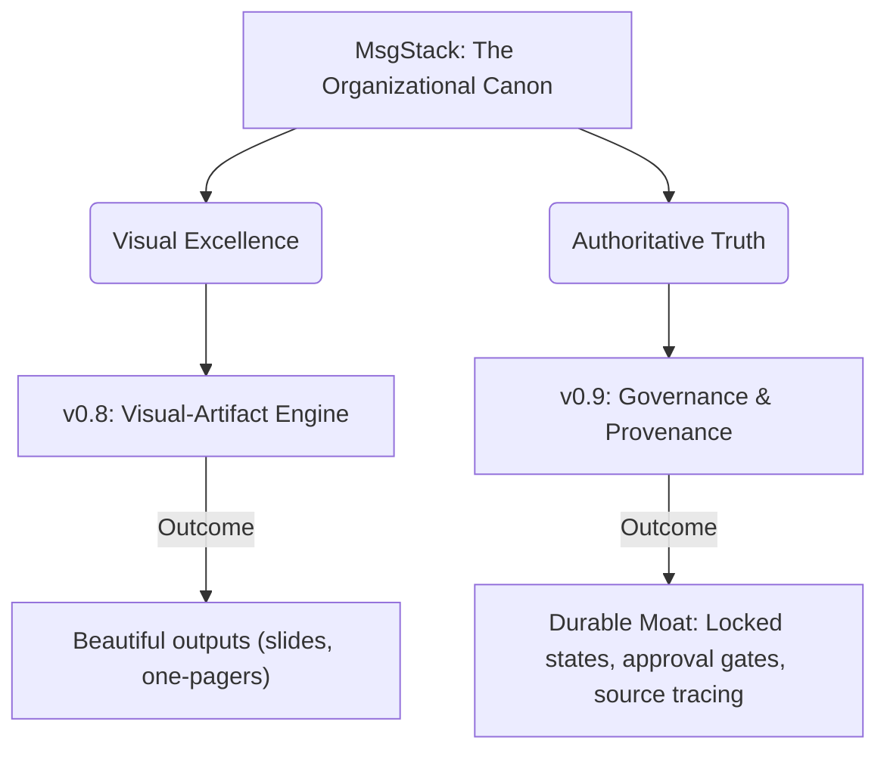

# Decision Memo: Pull Canon Governance Ahead of Visual-Artifact Engine?

**Proposed Title for GitHub Issue/Discussion**: `Roadmap: pull canon governance ahead of visual-artifact engine?`

---

## Executive Summary

MsgStack has repositioned from a legacy marketing-focused "messaging framework" generator to an authoritative **Organizational Canon**—the structured, always-current layer of approved truth that AI agents and humans ground on to eliminate hallucination. 

To make this positioning technically true and durable, we must evaluate our roadmap sequencing. Currently:
*   **v0.8** is scheduled for the **Visual-Artifact Engine** (producing stylized PDFs, slides, and web views).
*   **v0.9** is scheduled for the **Governance & Provenance Layer** (status lifecycles, approval-gated retrieval, and version auditing).

This memo highlights the trade-offs between these two milestones and strongly recommends pulling the core governance primitives forward.

---

## Trade-off Analysis

### Option A: Stick to the Roadmap (v0.8 Visual-Artifact Engine First)

*   **Focus**: Rich visual renders, custom styling themes, PDF export, and Reveal.js templates.
*   **Pros**:
    *   **High Visual Appeal**: Immediate "wow" factor for human stakeholders looking at generated one-pagers or slides.
    *   **Demonstrable Utility**: Concrete outputs that demonstrate end-to-end flow from raw text to polished assets.
*   **Cons**:
    *   **Positioning Gap**: An AI connecting to the MCP server has no way of knowing if a retrieve chunk is draft/stale/unapproved. The server is still functioning as a template engine, not a "canon layer."

### Option B: Reprioritize (v0.8 Core Governance & Provenance First)

*   **Focus**: Implementing entry status lifecycle (`Draft` | `In Review` | `Approved` | `Outdated` | `Locked`), enforcing approval-gated grounding (AI search filters out unapproved entries), and maintaining source/audit trails.
*   **Pros**:
    *   **Aligns with Positioning**: Directly establishes the technical foundation for the "durable canon of approved truth."
    *   **Safety & Trust**: Guarantees that AI clients grounding on MsgStack cannot retrieve unapproved or stale details, solving the hallucination problem at the source.
*   **Cons**:
    *   **Lower Initial Visual Polish**: Assets and dashboard pages will remain in basic markdown or simple HTML visual previews longer.

---

## Recommendation

**We recommend Option B: Pull core governance primitives (entry status lifecycle, approval-gated grounding, and basic audit logs) ahead of the visual-artifact engine.**

### Rationale:
1.  **Governance is the Moat**: What makes a domain "canon" rather than a regular wiki or text file is *governance*—knowing exactly who approved a tagline, when, and matching it to source documentation.
2.  **Safety First**: AI agents calling the MCP tools need bulletproof grounding. Enforcing that only `APPROVED` entries are visible to clients is the highest-priority safety feature.
3.  **Minimal UI Overlap**: Implementing the lifecycle state machine in the database and API first allows the visual engine (when built) to respect these states natively, preventing rewrite cycles.

---

## Proposed Next Steps (Upon Approval)
1.  Update `ROADMAP.md` to shift **v0.8** to "Canon Governance & Grounding Safety" and **v0.9** to "Visual-Artifact Engine & Exporting."
2.  Design the entry status state-transition model in the API and update the grounding search engine to filter query results by status.
